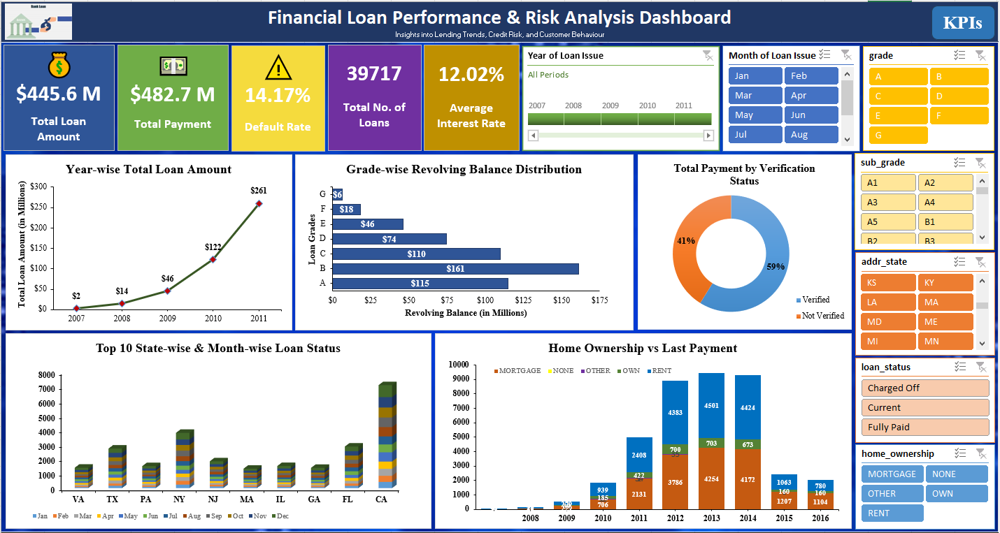
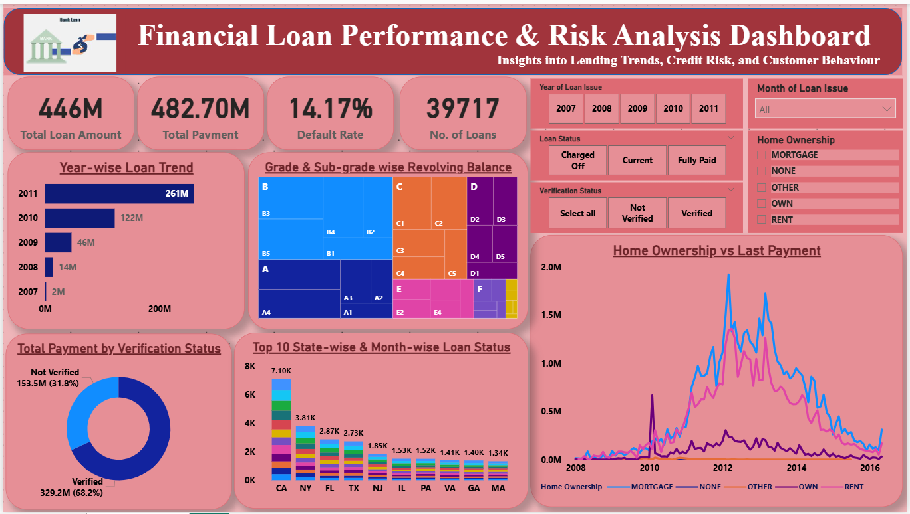
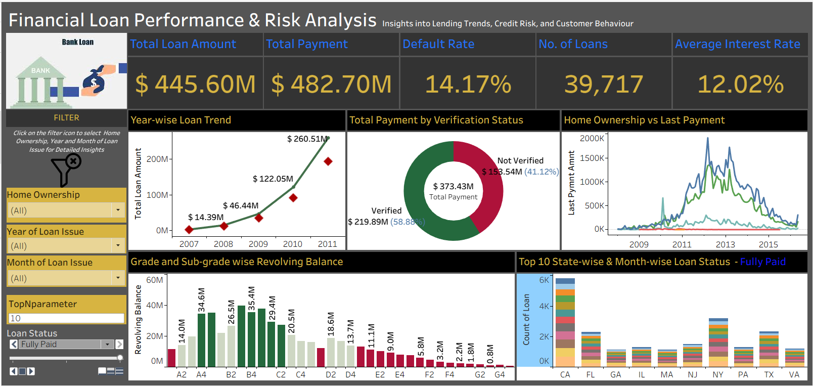

# Banking Analytics Dashboard

## Overview

This project analyzes banking loan data to identify customer trends, loan performance, and credit risk using SQL, Excel, Tableau, and Power BI. The dashboards provide actionable insights into loan approvals, repayments, default rates, customer demographics, and business performance.

## Tools Used

- MySQL
- Microsoft Excel
- Power BI
- Tableau

## Skills Demonstrated

- Data Cleaning
- ETL Process
- SQL Queries
- Data Analysis
- Dashboard Development
- KPI Reporting
- Data Visualization

## Key KPIs

- Total Loan Amount
- Total Payments
- Average Interest Rate
- Default Rate
- Loan Status Analysis
- State-wise Loan Distribution
- Month-wise Loan Trends

## Business Insights

The analysis helps financial institutions monitor loan performance, identify high-risk segments, and support data-driven lending decisions.

## Dashboard Preview

### Excel Dashboard

 

### Power BI Dashboard

### Tableau Dashboard

