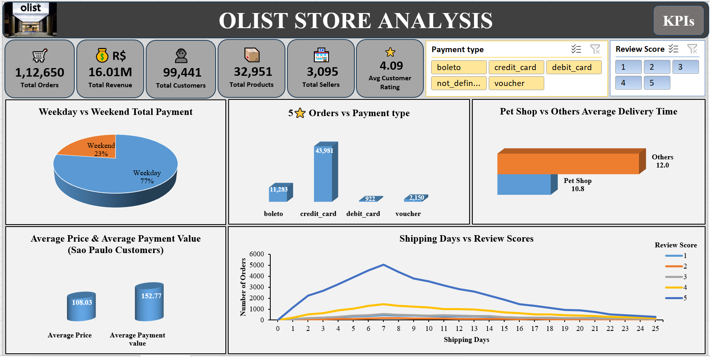

# E-commerce Analytics Dashboard

## Overview

This project analyzes e-commerce sales, customer behavior, product performance, and payment trends using SQL, Excel, Tableau, and Power BI. It transforms raw transactional data into interactive dashboards that provide actionable business insights for improving sales and customer experience.

## Skills Demonstrated

- Data Cleaning
- ETL Process
- SQL Query Writing
- Data Analysis
- Dashboard Development
- KPI Reporting
- Business Intelligence

## Key KPIs

- Total Revenue
- Total Orders
- Total Customers
- Product Category Performance
- Payment Type Analysis
- Customer Review Analysis
- Average Delivery Time
- Weekday vs Weekend Sales

## Business Insights

The analysis identifies customer purchasing patterns, high-performing product categories, preferred payment methods, and delivery performance, enabling businesses to optimize operations and enhance customer satisfaction.

## Dashboard Preview

### Excel Dashboard

 

### Power BI Dashboard

### Tableau Dashboard

