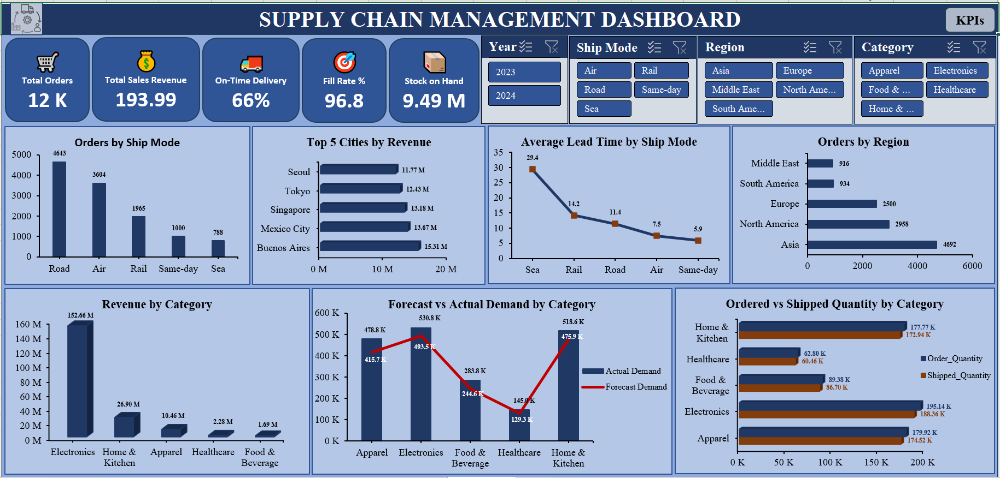
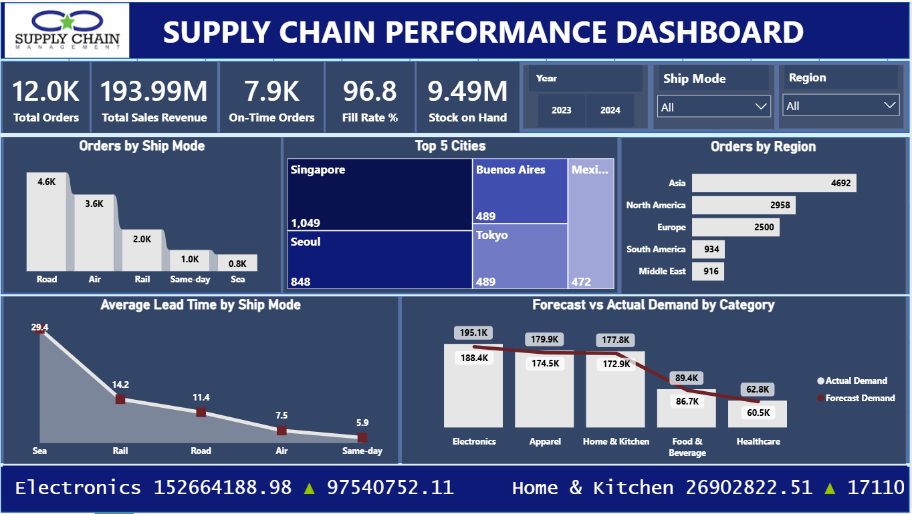
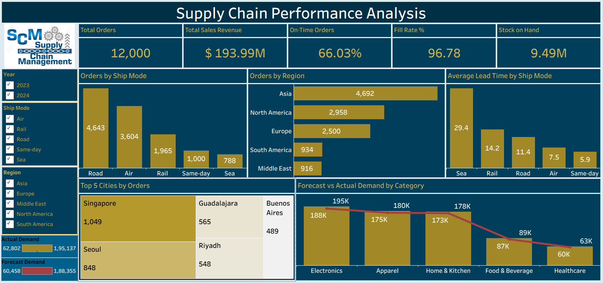
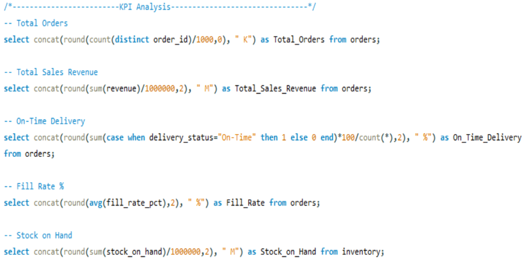
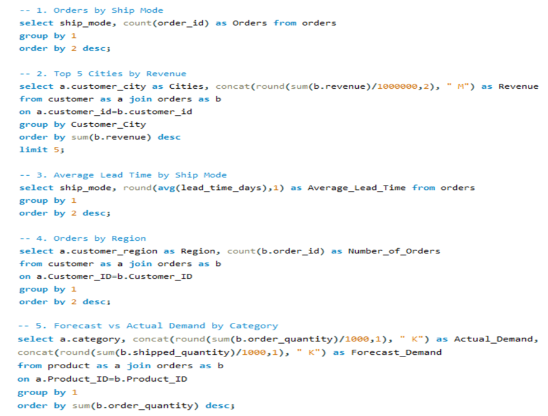

# 📦 Supply Chain Analytics

## 📌 Overview

This project analyzes supply chain operations to improve efficiency, optimize inventory management, evaluate supplier performance, and monitor order fulfillment using SQL, Excel, Tableau, and Power BI.

---

## 📊 Skills Demonstrated

- Data Cleaning & Transformation
- SQL Query Writing
- ETL Process
- Dashboard Development
- KPI Reporting
- Data Visualization
- Business Intelligence

---

## Dashboard Preview

### Excel Dashboard

 

### Power BI Dashboard

### Tableau Dashboard

### SQL Queries 

