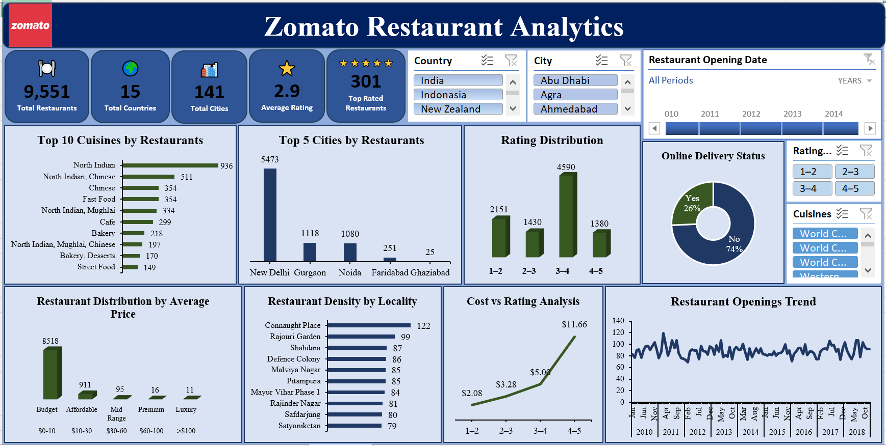
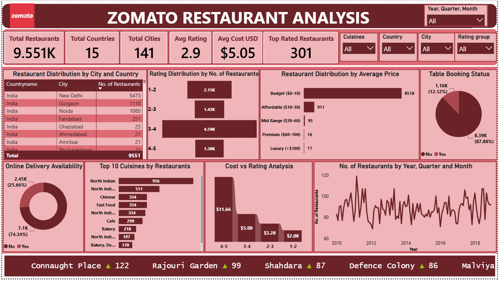

# 🍽️ Zomato Restaurant Analytics

## 📌 Overview

This project analyzes Zomato restaurant data to uncover insights into restaurant ratings, cuisines, online delivery, table booking, pricing, and customer preferences. The analysis was performed using MySQL, Excel, Tableau, and Power BI to support data-driven business decisions.

---

## 🛠️ Tools & Technologies

- MySQL
- Excel
- Power BI
- Tableau

---

## 📊 Skills Demonstrated

- Data Cleaning & Transformation
- SQL Query Writing
- ETL Process
- Dashboard Development
- Data Visualization
- Business Intelligence
- KPI Reporting

---

## 📈 Key KPIs

- Total Restaurants
- Total Countries
- Total Cities
- Average Rating
- Online Delivery Availability
- Table Booking Availability
- Cuisine Distribution
- Restaurant Rating Analysis
- Cost Analysis
- Top Rated Restaurants

---

## 💡 Business Insights

- Identified cities and countries with the highest restaurant concentration.
- Analyzed customer ratings to identify top-performing restaurants.
- Evaluated the impact of online delivery and table booking services.
- Compared restaurant pricing across different regions.
- Identified popular cuisines and customer preferences.

---

## 📂 Project Files

- SQL Scripts
- Excel Dashboard
- Tableau Dashboard
- Power BI Dashboard
- Dashboard Screenshots

---

## 🎯 Outcome

This project demonstrates an end-to-end analytics workflow, from data cleaning and SQL analysis to interactive dashboards and business insights using multiple visualization tools.

---

## Dashboard Preview

### Excel Dashboard

 

### Power BI Dashboard

### Tableau Dashboard

